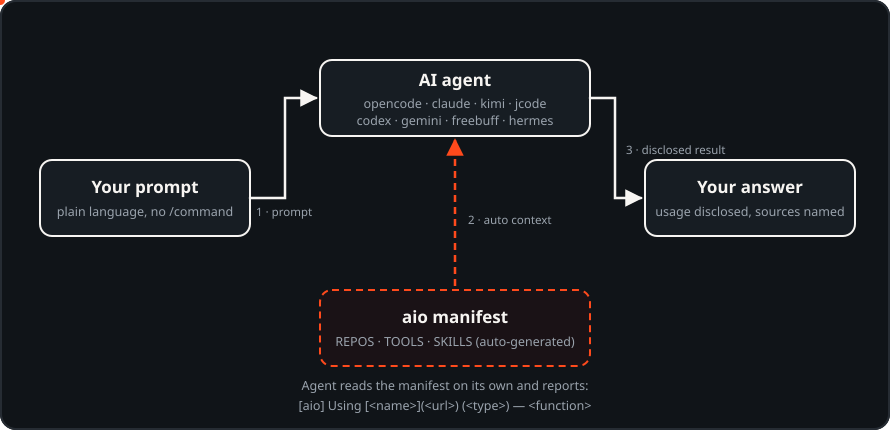

<p align="center">
  
</p>

<h1 align="center">aio — all-in-one-repo</h1>

<p align="center">
  <b>Auto-connect your AI coding agents to your local repos, tools &amp; skills.</b><br>
  No slash-commands. No manual config. One command.
</p>

<p align="center">
  <a href="./PRD.md">📜 PRD</a> ·
  <a href="./docs/flow.md">🌊 How it works</a> ·
  <a href="./docs/CONFIG.md">⚙️ What changes</a> ·
  <a href="./assets/logo-gallery.html">🎨 Brand kit</a>
</p>

<p align="center">
  
  = 22">
  
  
  
</p>

<p align="center">
  
</p>

---

## Highlights

- **Zero runtime dependencies** — plain Node.js ≥ 22 standard library only
- **Idempotent** — the auto-use block exists exactly once per file, ever
- **One command** — `aio` scans, generates and injects in a single run
- **8 agents covered** — opencode · claude · kimi · jcode · codex · gemini · freebuff · hermes
- **Honest agents** — usage of any repo/tool/skill is disclosed as a link:
  `[aio] Using [<name>](<url>) (<type>) — <function>`
- **Fully reversible** — `aio rollback` restores every touched file from backups

## Why

Local AI agents (opencode, claude, kimi, …) know nothing about your machine:
which repositories you cloned, which tools you installed, which skills you
collected. You end up explaining it every session — or wiring MCP servers and
instruction files by hand.

`aio` does the wiring once, then keeps it fresh:

1. **Scan** — detects installed agents, your repos directory, your tools
   catalog, and your global skills.
2. **Generate** — writes a context manifest (`aio-context.md`) listing
   `REPOS · TOOLS · SKILLS`.
3. **Inject** — appends a marker-delimited *auto-use block* to each agent's
   instruction file (idempotent — always exactly one copy).
4. **Ensure** — adds `codebase-memory-mcp` to opencode / claude / kimi /
   jcode / codex / gemini configs when the binary exists and the entry is
   missing.
5. **Repair** — fixes stale path references after folder renames.

Then you just open an agent and write normal, plain-language prompts. The agent
routes itself through the manifest and **must disclose what it used**:

```text
[aio] Using [<name>](<url>) (<type>) — <function>
```

Example (real output from a running agent):

```text
[aio] Using [nano-pdf](https://github.com/nano-micro/nano-pdf) (skill) — Extract text from PDFs/scans (pymupdf, marker-pdf).
```

## Install

```bash
npm install -g aio-connect
```

> The npm name `aio` was already taken — the package is published as
> **`aio-connect`**, the binary stays `aio`. (Installing straight from GitHub
> with `npm install -g github:MRaihan-XXL/all-in-one-repo` also works.)

Requires **Node.js ≥ 22** (uses the built-in `node:sqlite`, optional).

## Usage

```bash
aio                # scan + generate + inject (default command)
aio update         # update from npm, then re-run setup
aio rollback       # surgically remove everything aio injected
aio --help         # full help
```

Options:

| Option | Env | Default |
|---|---|---|
| `--repos <dir>` | `AIO_REPOS_DIR` | `D:\Tools\github` (if it exists) |
| `--home <dir>` | `AIO_HOME` | persisted state → walk up from cwd |

## What changes on your machine

Everything aio writes is documented in **[docs/CONFIG.md](./docs/CONFIG.md)**.
Short version:

- `aio-context.md` — generated manifest (yours to delete anytime)
- one `AIO AUTO-CONTEXT` block in each agent's instruction file
  (`~/.config/opencode/AGENTS.md`, `~/.claude/CLAUDE.md`,
  `~/.kimi-code/AGENTS.md`, `~/.jcode/AGENTS.md`, `~/.codex/AGENTS.md`,
  `~/.gemini/GEMINI.md`, `~/AGENTS.md`)
- MCP entry for `codebase-memory-mcp` — only if missing, only if detected
- a file backup of every file before it is modified → `~/.aio/backups/`

Nothing else is touched. Local data (`ai-tools.db`, `TOOLS-INDEX.md`,
`TRACKING.md`, screenshots) is **git-ignored** and never uploaded.

## Keeping it fresh

- **Clone a new repo?** Run `aio` again — it rescans on every run, so new
  repositories and tools appear in the manifest automatically.
- **Agent updated its config format?** `aio update` pulls the latest rules
  from npm and re-runs setup.
- **Want your machine back?** `aio rollback` removes the injected block and
  any MCP entry that *aio itself* added (your own entries are never touched;
  file backups are kept as a safety net).

## Supported agents

| Agent | Where the auto-use block lands | MCP ensured |
|---|---|---|
| `opencode` | `~/.config/opencode/AGENTS.md` | ✅ `opencode.jsonc` |
| `claude` | `~/.claude/CLAUDE.md` | ✅ `~/.claude.json` |
| `kimi` | `~/.kimi-code/AGENTS.md` | ✅ `~/.kimi-code/mcp.json` |
| `jcode` | `~/.jcode/AGENTS.md` (fallback `~/AGENTS.md`) | ✅ `~/.jcode/mcp.json` |
| `codex` | `~/.codex/AGENTS.md` | ✅ `~/.codex/config.toml` |
| `gemini` | `~/.gemini/GEMINI.md` | ✅ `~/.gemini/settings.json` |
| `freebuff` | `~/AGENTS.md` (fallback) | — |
| `hermes` | `~/AGENTS.md` | — |

Detection is by `PATH` binary **or** the agent's config directory — codex and
gemini are wired even without a shell wrapper.

## Brand kit

The identity ("three streams, one node"), palette, favicon sizes, CLI banner
grid and usage rules live in
**[assets/logo-gallery.html](./assets/logo-gallery.html)** (open it in a
browser); source SVGs are in [`assets/`](./assets/).

## Development

```bash
npm test          # node --test — self-checks for injection/rollback/scan
node bin/aio.js   # run from a checkout without installing
```

## License

[GPL-3.0](./LICENSE) © MRaihan-XXL
