<p align="center">
  
</p>

<h1 align="center">aio — all-in-one</h1>

<p align="center">
  <b>Auto-connect every AI coding agent to your repos, tools, skills &amp; websites.</b><br>
  No slash-commands. No manual config. One command — then it searches for you.
</p>

<p align="center">
  <a href="https://www.npmjs.com/package/aio-connect"></a>
  <a href="https://github.com/MRaihan-XXL/all-in-one/actions/workflows/ci.yml"></a>
  
  = 22">
  
  
</p>

<p align="center">
  <a href="./PRD.md">📜 PRD</a> ·
  <a href="./docs/flow.md">🌊 How it works</a> ·
  <a href="./docs/CONFIG.md">⚙️ What changes</a> ·
  <a href="./assets/logo-gallery.html">🎨 Brand kit</a>
</p>

---

<p align="center">
  
</p>

<p align="center">
  
</p>

<p align="center">
  
</p>

## ✨ What it does

`aio` has **no bundled catalog and no database** — it teaches every AI agent on
your machine to **search live on each prompt**: GitHub (**630M+ repos** plus
`filename:SKILL.md` public skills — **6.8M+ skill files**), npm (**3M+
packages**) and crates (**340K+ crates**), queried in parallel — all counts are
**verified floors, measured 2026-09-30**; websites go through your agent's
own built-in web search. Results are printed, ranked and discarded — **no
search history is stored** (aio's own files are the manifest, one block per
agent file, timestamped backups and `config.json`, all listed in
[docs/CONFIG.md](./docs/CONFIG.md)). The counts above are **the corpora aio
can reach — the searchable universe, not aio's own size; ranking is not
capped by them**:

```text
prompt → aio ask (live: github ∥ npm ∥ crates) → top-8 + diversity (BM25 + ≥2 rows/source)
       → use it ephemerally → report WHAT changed + EVERY link used + function
       → aio borrow --clean
```

> **Auth:** GitHub works unauthenticated at low rate; `gh auth login` (or `GH_TOKEN`)
> unlocks the skills lane (code search requires auth — otherwise it returns `[]`) and
> raises the rate limit. Details: [docs/CONFIG.md](./docs/CONFIG.md).

| Command | What you get |
|---|---|
| `aio` | scan → slim manifest → inject the auto-use block into every agent — add `--dry-run` to preview every change, write nothing |
| `aio ask "csv ke chart"` | **live search** across GitHub (630M+ repos + public skills), npm (3M+ pkgs) and crates (340K+) in parallel (4 s per source), merge-ranked with BM25 + source diversity, blended 65% keyword relevance + 35% source popularity (stars/downloads/npm score); every hit prints **link + one-line function + `<github>`/`<npm>`/`<crates>` tag**; reranked by your local Ollama (qwen3) only when it is warm and fast; `--json` → `{…, stored: 0, hits}` (`stored: 0` = no search results stored) |
| `aio borrow "etl tool"` | **optional ephemeral fetch** — `--get owner/repo` shallow-clones to temp (**24 h TTL**, auto-purged), `--list` inspects, `--clean` wipes it. Not a fallback for `ask`: use it when you actually need the files locally |
| `aio doctor` | self-diagnosis: node · state · live sources · manifest ↔ agent blocks ↔ Ollama; `--fix` repairs, `--check` = CI gate |
| `aio evolve` | the whole self-upgrade pipeline in one run: setup (manifest+blocks) → doctor --check → npm test (never commits) |
| `aio status` | read-only health report |
| `aio update` / `aio rollback` | update from npm / remove everything aio injected |

Example — real `aio ask` output, abridged (links + functions always included):

```text
aio ask — "awesome animated chart library" (live: github+npm · 8 results · 5.0s)

note: ranked by keyword match + source popularity — public results are unvetted;
      verify before running npx/uvx or cloning (docs/THREATS.md).

1. lightweight-charts [tool] <npm> — Performant financial charts built with HTML5 canvas
   v5.2.1 · financial-charting-library · charting-library · html5-charts
   https://www.npmjs.com/package/lightweight-charts
   why: BM25 keyword match (#1) + trust high
2. vizzuhq/vizzu-lib [repo] <github> — Library for animated data visualizations and data stories.
   ★2037 · JavaScript
   https://github.com/vizzuhq/vizzu-lib
   why: BM25 keyword match (#2) + trust high
```

## 📦 Install

```bash
npm install -g aio-connect
```

> The npm name `aio` was taken — the package is **`aio-connect`**, and it ships
> two binaries: **`aio` and `aioc`** (`aioc` is an alias). Adobe's App Builder
> CLI (`@adobe/aio`) also owns the binary name `aio` on PATH — if both are
> installed globally, use `aioc` for this tool, or run via `npx aio-connect`.
> Requires **Node.js ≥ 22** (zero runtime dependencies).

## 🤖 Honesty is the product

Every agent that reads the manifest **must disclose what it used**, as the
first line of its reply. Enforcement is **instruction-level**: aio injects
that rule into every agent file; compliance is model-dependent (see the
FR6/kimi note below). The required line:

```text
[aio] Using [<name>](<url>) (<type>) — <function>
```

and every final report lists the work done **plus each repo/tool/site as a
markdown link with a one-line function**:

```text
- [[d3](https://github.com/d3/d3)] — chart library, rendered the bar chart
Changes: added chart.js, wired the data feed.
```

`<type>` = `repo | cli | service | skill | site`.

<p align="center">
  
</p>

## 🔁 No search storage

- **No search history by design**: no `ai-tools.db`, no local catalog, no search
  history — `aio ask` results are printed and discarded (**zero search
  storage — results printed, never saved**), and the npm package ships no
  database (`files` = bin, src, assets, docs). What aio *does* write: the
  manifest `~/.aio/aio-context.md`, one `AIO AUTO-CONTEXT` block per agent
  file, timestamped backups under `~/.aio/backups/`, and `~/.aio/config.json`
  — all listed in [docs/CONFIG.md](./docs/CONFIG.md).
- `aio borrow --get` clones into `%TEMP%/aio-borrow` with a **24-hour TTL** —
  the next run purges it, `--clean` wipes everything now.
- CLI tools are consumed via `npx` / `uvx` — never installed permanently.

## ⚙️ What changes on your machine

Everything aio writes is documented in **[docs/CONFIG.md](./docs/CONFIG.md)**.
Short version: one `AIO AUTO-CONTEXT` block per agent instruction file, the
generated `aio-context.md`, MCP entries *only if missing*, and a timestamped
backup of every touched file under `~/.aio/backups/` first. `aio rollback`
reverses exactly what aio added — your own config is never touched.
No telemetry; the only network calls are your explicit `ask`/`borrow`,
`doctor`'s reachability probe, and the agent's own.

## 🕵️ Keeping it fresh

- **New repo cloned?** Run `aio` — the manifest rebuilds from the fresh scan
  (clones feed only the optional install plan; the catalog itself stays live).
- **Something drifted?** `aio doctor --fix` (or `--check` in CI).
- **Full self-upgrade?** `aio evolve` runs setup (manifest+blocks) →
  doctor --check → npm test and prints the diff; committing stays your call.
- **Want your machine back?** `aio rollback`.

## 🧩 Supported agents

| Agent | Where the auto-use block lands | MCP ensured | FR6 (disclosure) |
|---|---|---|---|
| `opencode` | `~/.config/opencode/AGENTS.md` | ✅ `opencode.jsonc` | PASS |
| `claude` | `~/.claude/CLAUDE.md` | ✅ `~/.claude.json` | PASS |
| `kimi` | `~/.kimi-code/AGENTS.md` | ✅ `~/.kimi-code/mcp.json` | **⚠ model-dependent** |
| `jcode` | `~/.jcode/AGENTS.md` (fallback `~/AGENTS.md`) | ✅ `~/.jcode/mcp.json` | PASS |
| `codex` | `~/.codex/AGENTS.md` | ✅ `~/.codex/config.toml` | PASS |
| `gemini` | `~/.gemini/GEMINI.md` | ✅ `~/.gemini/settings.json` | PASS |
| `freebuff` | `~/AGENTS.md` (fallback) | — | PASS |
| `hermes` | `~/AGENTS.md` | — | PASS |

> **FR6** = free-form prompt probe: the agent must open its reply with the
> manifest's disclosure line. kimi quotes the rule but does not apply it
> after 9 attempts — model/harness-dependent, not a packaging bug.

## 🛡 Security

- Threat model: **[docs/THREATS.md](./docs/THREATS.md)** — assets, trust
  boundaries, the T1–T7 threat table, known gaps, reporting.
- **Trust-weighted ranking** — final order = 65% BM25 keyword relevance
  (keyword overlap is the gate) + 35% source popularity prior (`trust01`:
  GitHub stars, npm score, crates downloads; skills neutral), and every
  `aio ask` output ends with:
  `note: ranked by keyword match + source popularity — public results are unvetted; verify before running npx/uvx or cloning (docs/THREATS.md).`
- **`aio --dry-run`** — plan-only setup: prints exactly what would change
  (block inject/update, MCP would-add, path repairs, manifest would-write)
  and writes nothing. No backup, no state write.
- **Writes are guarded** — timestamped backup of every touched file before
  modification, malformed target configs reported as `parse error` and never
  overwritten, rollback ledger for MCP entries (`aio rollback` reverses
  exactly what aio added).
- **`gh` token** — read at call time into memory only, never logged or
  persisted; authenticated requests also raise the GitHub rate limit.
- **Packaging** — zero runtime dependencies, no install/postinstall scripts,
  npm publish behind 2FA/EOTP.
- Known gaps, stated plainly: releases are not signed, and disclosure is
  instruction-level (model-dependent), not technically enforced.

## 🛠 Development

```bash
npm test             # node --test — 52 checks (live search, injection, borrow, doctor, …)
node bin/aio.js      # run from a checkout without installing
node bin/aio.js ask "pdf ke word"
node bin/aio.js doctor --check
node scripts/eval-relevance.mjs   # live 20-query golden set → hit@8 = 20/20 (100%), hit@1 = 19/20 (95%), MRR 0.97, measured 2026-10-01
```

## 🎨 Brand kit

Identity ("three streams, one node"), palette, favicon sizes, CLI banner grid
and usage rules live in **[assets/logo-gallery.html](./assets/logo-gallery.html)**;
source SVGs (including the animated hero + flowchart) are in
[`assets/`](./assets/).

## License

[GPL-3.0](./LICENSE) © MRaihan-XXL
